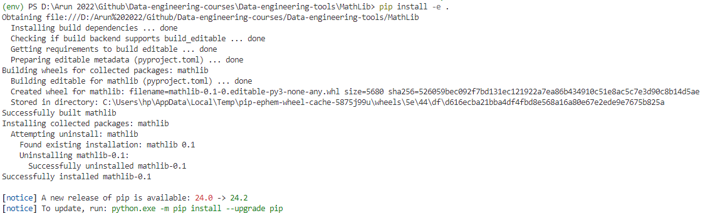
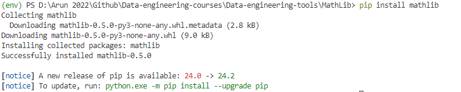
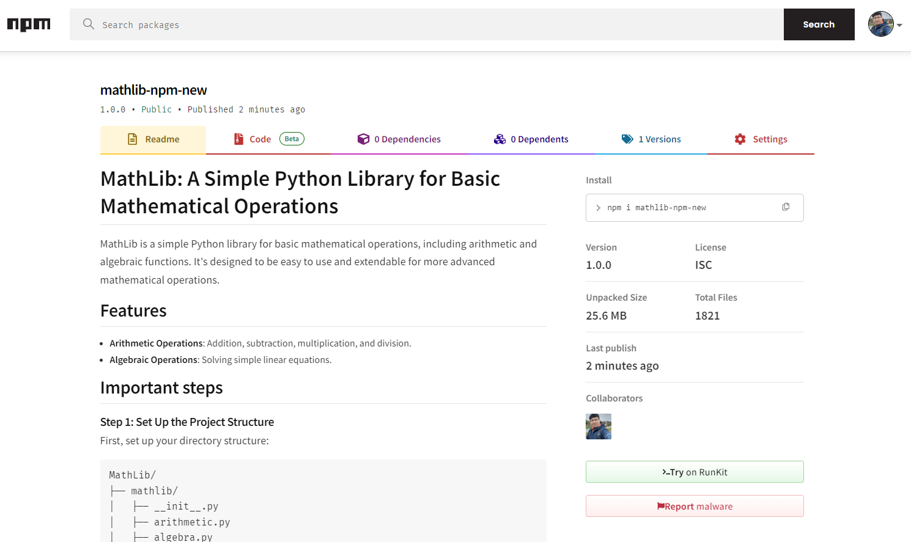

# MathLib: A Simple Python Library for Basic Mathematical Operations

MathLib is a simple Python library for basic mathematical operations, including arithmetic and algebraic functions. It's designed to be easy to use and extendable for more advanced mathematical operations.

## Features

- **Arithmetic Operations**: Addition, subtraction, multiplication, and division.
- **Algebraic Operations**: Solving simple linear equations.

## Important steps

### Step 1: Set Up the Project Structure

First, set up your directory structure:

```
MathLib/
├── mathlib/
│   ├── __init__.py
│   ├── arithmetic.py
│   ├── algebra.py
│   ├── complex_numbers.py
│   ├── logarithmic.py
│   ├── matrix_operations.py
│   ├── power_roots.py
│   ├── random_utils.py
│   ├── statistics.py
│   ├── trigonometry.py
│   └── utility.py
├── tests/
│   ├── test_arithmetic.py
│   ├── test_algebra.py
│   ├── test_complex_numbers.py
│   ├── test_logarithmic.py
│   ├── test_matrix_operations.py
│   ├── test_power_roots.py
│   ├── test_random_utils.py
│   ├── test_statistics.py
│   ├── test_trigonometry.py
│   └── test_utility.py
├── setup.py
├── README.md
└── LICENSE
```

### Step 2: Write the Package Code

#### `mathlib/__init__.py`
This file makes the `mathlib` directory a package.

```python
# mathlib/__init__.py

from .arithmetic import add, subtract, multiply, divide, power
from .algebra import solve_linear, solve_quadratic
from .trigonometry import sin, cos, tan, arcsin, arccos, arctan
from .statistics import mean, median, variance, standard_deviation
from .matrix_operations import matrix_addition, matrix_multiplication, matrix_determinant, matrix_inverse
from .complex_numbers import complex_addition, complex_subtraction, complex_multiplication, complex_division, complex_magnitude, complex_phase
from .random_utils import random_integer, random_float
from .utility import factorial, gcd, lcm

__all__ = [
    'add', 'subtract', 'multiply', 'divide', 'power',
    'solve_linear', 'solve_quadratic',
    'sin', 'cos', 'tan', 'arcsin', 'arccos', 'arctan',
    'mean', 'median', 'variance', 'standard_deviation',
    'matrix_addition', 'matrix_multiplication', 'matrix_determinant', 'matrix_inverse',
    'complex_addition', 'complex_subtraction', 'complex_multiplication', 'complex_division', 'complex_magnitude', 'complex_phase',
    'random_integer', 'random_float',
    'factorial', 'gcd', 'lcm'
]
```

Next Create the python files for various kind of mathematical functions.

### Step 3: Write Tests

To ensure your package functions as expected, it's essential to write some basic tests. Pytest is a powerful tool for this purpose and is widely recommended for Python projects. It helps you write simple and scalable test cases to validate your code.


### Step 4: Set Up the Package Metadata

#### `setup.py`

```python
# setup.py

from setuptools import setup, find_packages

setup(
    name='mathlib',
    version='0.1',
    packages=find_packages(),
    description='A simple math library with basic operations',
    long_description=open('README.md').read(),
    long_description_content_type='text/markdown',
    author='Arun Kumar Pandey',
    author_email='arunp77@gmail.com',
    url='https://github.com/arunp77/mathlib-package.git',
    license='MIT',
    install_requires=[],
    classifiers=[
        'Programming Language :: Python :: 3',
        'License :: OSI Approved :: MIT License',
        'Operating System :: OS Independent',
    ],
)

```
This `setup.py` file is used to install the package using pip. It includes metadata such as

## Testing

To run the tests for this project, use `pytest`:

```bash
pytest tests/
```

This will run the test suite located in the `tests` directory, ensuring that all functions work as expected.

To check the individial operations, go to the test folder and run each file with `pytest`. FOr example, to check the operations insdie the functions defined in algebra.py, run:
```bash
pytest algebra.py
```
---------

## Installation
- **Step-1: Install the Package Locally**

    You can install MathLib directly from the source code:

    ```bash
    git clone https://github.com/arunp77/Data-engineering-tools.git
    ```
    Navigate to the root directory of your project (where setup.py is located) 
    ```bash
    cd /Data-engineering-tools/mathlib
    ```
    and then run:
    ```bash
    pip install -e . -v
    ```
    The `-e` flag stands for "editable," which means any changes you make to the code will immediately be reflected without needing to reinstall the package. Here `-v` will give you more detailed output about what is happening during the installation process.

    

    We can alsi install it using:

    ```bash
    pip install mathlib
    ```
    

- **Step 2: Verify Installation**
  
  After running the installation, you can verify that the package was installed by running:

    ```bash
    pip show mathlib
    ```
    This should display information about the mathlib package, such as the version and location.

    > **Verify Import in Python Shell:**
    > Try importing mathlib directly in the Python shell to ensure it is correctly recognized:
    > ```bash
    > >>> import mathlib
    >
    > >>> mathlib
    > ```
    > We can also install mathlib, directly using `setup.py` file, using:
    > ```bash
    > python setup.py install --verbose
    > ```
    > This will give you more detailed output about what is happening during the installation process.
    >
    > If you're using `pip install`, you can add the `-v` option for verbose output:


- **Step 3: Run the Tests**
  Once the package is installed, you should run the tests to ensure everything is working as expected.

  Navigate to the root directory of your project and run:
  ```bash
    pytest tests/
  ```
  This will execute the tests defined in `tests/test_arithmetic.py` and `tests/test_algebra.py`. If all the tests pass, it indicates that your package is functioning correctly.

- **Step 4: Create Docekrimage**
  ```bash
  docker build -t arunp77/mathlib:latest .
  ```

  and then push it to DOcker. 
  ```bash
  docker push arunp77/mathlib:latest
  ```

  Here, you must remember that, you must have created a Docker Access token from the DOcker hub and then saved it to your Github secrets. FOr more details on this, you can follow step by step guide provided at [my documentation page created for another project](https://github.com/arunp77/Job-Market-project/blob/main/Docker-image-integration.md)
  
  Image of the library is available at: [https://hub.docker.com/r/arunp77/mathlib](https://hub.docker.com/r/arunp77/mathlib)

# Package

This is also available as package on npm on following [link](https://www.npmjs.com/package/mathlib-npm-new).



## Contributing

Contributions are welcome! If you'd like to improve MathLib, please fork the repository and create a pull request with your changes. Make sure to update the tests as needed.

## License

This project is licensed under the MIT License - see the [LICENSE](LICENSE) file for details.

## Contact

For questions or suggestions, feel free to reach out at [arunp77@gmail.com](mailto:arunp77@gmail.com).
